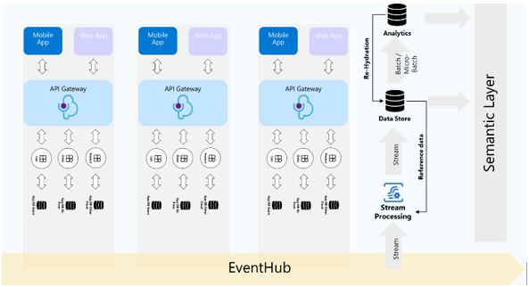

# Fabric CloudODS Demo 
## The Resurgence of the Operational Data Store

 

Since the beginning of multi-user applications such as ERP, CRM, TMS and ITSM applications there has been a need to be able to display operational dashboards to monitor phone queues, stock levels, team performance and  general ops.
This requirement has in most cases come with technical implementation complexities, from managing database server performance so that the operational dashboards don’t sink the application or managing scenarios that need to span across systems creating complex and expensive patterns that compromise on quality and reliability.

One of the patterns that have always been a central part of this in the enterprise data architecture has been the operational data store (ODS). The ODS has three distinct functions.
1.	Support operational reporting
2.	Support application database consolidation
3.	Act as an integration layer between Applications and Analytics

Image Credit: Athena IT Solutions and ScienseDirect.com

The above image depicts how  the ODS have been traditionally implemented and viewed, this implementation has a few challenges in terms of meeting todays demand to be able to provide low latency operational reporting in todays cloud reality where we have many operational systems with databases of many dialects and flavours. We also have new concepts such as AI Agents and self service analytics. 
Lets consider the following scenario:

## Scenario brief:
Adventure works Global has many ecommerce portals across the world that are hosted on premise and in the cloud, each portal has two PostgreSQL databases and one SQL Server database server.
The application consists of transactions that are managed using a micro services architecture and one end to end transaction generate data across all three application databases. 

The global operations business unit of Adventure works wants to create a consistent operational reporting data store that can be used to simplify the existing complex data APIs that are serving data back to the application, furthermore the data services division is planning on building out a customer self-services capability that will introduce an agentic AI layer that enables customers to self-serve across the systems using natural language queries.

### Technical design requirements:
1.	The new data store must be low latency < 2 minutes.
2.	The new data store must consolidate into a single query engine.
3.	Data acquisition must support transactional replication with no table based DML transactions.
4.	CDC and Change capture is not allowed. 
5.	Data acquisition must support transparent data encryption on the source application databases.
6.	Data must respect corporate network boundaries.

## The Solution:
With the above requirements in mind the data solutions architecture team is considering Microsoft Azure’s PaaS offering combined with Microsoft Fabric as this meets all 6 requirements and supports the vision of global operations and data services.

To prove out the proposed design Adventure works have contracted a Solutions Integrator to build out a technical demo.

## Technical Demonstration Setup:

### Azure

•	Source Database: SQL Server 2022 (Standard D2ads v6 (2 vcpus, 8 GiB memory))

•	Test data: [Adventureworks LightWeight database](https://learn.microsoft.com/en-us/sql/samples/adventureworks-install-configure?view=sql-server-ver17&tabs=ssms)

•	Transaction velocity: Six sales transaction per second, comprising of 105 database transactions per second.

•	Azure SQL Managed instance size: General Purpose Standard-series (Gen 5) (4 vCores, 20GB Memory, 64 GB storage, Geo-redundant backup storage)

### Microsoft Fabric

•	Fabric SKU: F2 Capacity

•	Workspace setup: Two workspaces

    o	Workspace 1: Landing zone for the Mirrored Database

    o	Workspace 2: Consumption workspace for the Operational Data Store

### The Deployment:
Once the SI has deployed the demo assets in Azure he restores the [Adventureworks Lightweight 2022 database](https://learn.microsoft.com/en-us/sql/samples/adventureworks-install-configure?view=sql-server-ver17&tabs=ssms#restore-to-sql-server) on the SQL server he creates the [Transactional Replication](https://learn.microsoft.com/en-us/sql/relational-databases/replication/transactional/transactional-replication?view=sql-server-ver16) publication and creates a push subscription that pushes any changes to the Azure SQL Managed Instance.

Now that the simulated application databases are deployed and the replication is configured and running, he needs to prepare the replica database for Mirroring into Fabric.

For this he needs to ensure that there is no constraints or indexes that prevents any tables in the database from being mirrored, 
he runs the [Drop_incompatible_indexes.sql](/scripts/Drop_incompatible_indexes.sql) scrip against the replicated database on the Azure SQL Managed instance, he then executes the Alter table scripts one by one to ensure that the tables can be mirrored into Microsoft Fabric.

At this point the SI is ready to create the 1st Microsoft Fabric workspace that will act as the Landing Zone, they create a [workspace and assign Fabric Capacity](https://learn.microsoft.com/en-us/fabric/fundamentals/create-workspaces).

 

Next the SI creates a [Mirrored database for Azure SQL Managed Instance](https://learn.microsoft.com/en-us/fabric/database/mirrored-database/azure-sql-managed-instance-tutorial) and connect it to the Advetureworks Lightweight database replica.
He Selects the tables,

 

and names the Mirrored Data Warehouse

 	 

He then confirms that the Azure SQL Managed Instance database has generated the initial snapshots by executing the following command against the replicated database:
“EXEC sp_help_change_feed”
 
He then confirms that the Mirrored database in the ODS_POV workspace has been replicated and is accessible.

   

Now that data the replica is created the SI can now start building a data load, he does this by creating a stored procedure using the “Generate_SO.SQL” script.
In order to simulate a regular flow of transacions he creates a SQL Server Job that executes the new stored procedure every 10 seconds.
    

In order to test the performance from latancy from start to finish the SI executes the following SQL Script against the Replicated database:
 

The SI then executes the same script against the mirrored SQL endpoint and can observe consistent sub-minute latency.
 

The SI Now creates the Consumption Workspace and a Lakehouse that will be used for consumption.
 
The SI ensures that the Lakehouse Schemas is enabled as this will enable him to shortcut entire database schemas from the mirrored database.
  

